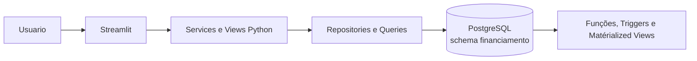

# Visão Geral da Arquitetura

## Contexto

O Nexus é uma aplicação web interna para gestão de contratos de financiamento,
projeções financeiras, bens, veículos e liquidacoes.

## Componentes

### Aplicação

- `src/main.py`: configura a navegação e inicia o Streamlit.
- `src/views`: telas e componentes de interação.
- `src/services`: regras de orquestração e chamadas de persistência.
- `src/repositories`: leitura e escrita no banco.
- `src/queries`: SQL utilizado pela aplicação.
- `src/database`: criação da conexão SQLAlchemy.
- `src/config`: leitura de variaveis de ambiente.

### Banco de dados

O PostgreSQL concentra a persistência e os cálculos financeiros. O modelo
inclui tabelas de contratos, bens, veículos, antecipações, Selic e feriados,
alem de funções, triggers, views e matérialized views.

## Fluxo arquitetural principal

1. O usuário interage com uma página Streamlit.
2. A view chama um service.
3. O service executa uma query ou repository.
4. O PostgreSQL valida, persiste e calcula.
5. A aplicação apresenta o resultado ou a falha ao usuário.

## Fronteiras e responsabilidades

A aplicação e responsável por apresentação, validações de entrada, transacoes
de acesso e mensagens. O banco e responsável por integridade referencial,
triggers, cálculos financeiros e matérialized views.

## Estado de maturidade

Autenticação, autorização, auditoria, filtros completos, API da Selic e telas
de bens, veículos e antecipação ainda fazem parte do desenvolvimento futuro.
