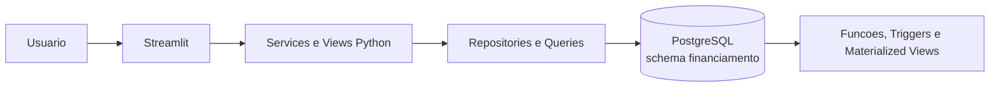

# Visao Geral da Arquitetura

## Contexto

O Nexus é uma aplicacao web interna para gestao de contratos de financiamento,
projecoes financeiras, bens, veiculos e liquidacoes.

## Componentes

### Aplicacao

- `src/main.py`: configura a navegacao e inicia o Streamlit.
- `src/views`: telas e componentes de interacao.
- `src/services`: regras de orquestracao e chamadas de persistencia.
- `src/repositories`: leitura e escrita no banco.
- `src/queries`: SQL utilizado pela aplicacao.
- `src/database`: criacao da conexao SQLAlchemy.
- `src/config`: leitura de variaveis de ambiente.

### Banco de dados

O PostgreSQL concentra a persistencia e os calculos financeiros. O modelo
inclui tabelas de contratos, bens, veiculos, antecipacoes, Selic e feriados,
alem de funcoes, triggers, views e materialized views.

## Fluxo arquitetural principal

1. O usuario interage com uma pagina Streamlit.
2. A view chama um service.
3. O service executa uma query ou repository.
4. O PostgreSQL valida, persiste e calcula.
5. A aplicacao apresenta o resultado ou a falha ao usuario.

## Fronteiras e responsabilidades

A aplicacao e responsavel por apresentacao, validacoes de entrada, transacoes
de acesso e mensagens. O banco e responsavel por integridade referencial,
triggers, calculos financeiros e materialized views.

## Estado de maturidade

Autenticacao, autorizacao, auditoria, filtros completos, API da Selic e telas
de bens, veiculos e antecipacao ainda fazem parte do desenvolvimento futuro.
